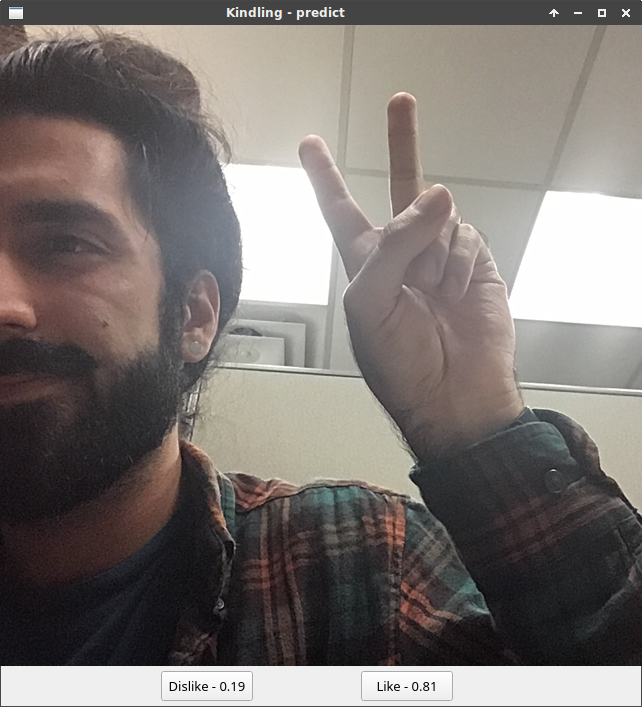

# Kindling

A neural network to learn your tinder preferences.

## Usage
Install dependencies by running
`
pip3 install -r requirements.txt
`
and make sure to have TensorFlow installed if you intend on training the network to your own preferences.

You must authorize Tinder to use your facebook, this can be done by copying **tinder_config.py**, filling in your credentials, and then renaming the copy to **config.py**.

Then simply run ** run.py **. This will take a while as it must gather about 1000 images. This is the bare minimum amount necessary as it takes about 500 images in each classification to really train the network.

## Components
- [Tinder's unofficial api](https://github.com/fbessez/Tinder)
- [CV-Tricks CNN tutorial](https://github.com/sankit1/cv-tricks.com)
- [PyQt5](http://pyqt.sourceforge.net/Docs/PyQt5/installation.html)
- [TensorFlow](https://www.tensorflow.org/install/)
